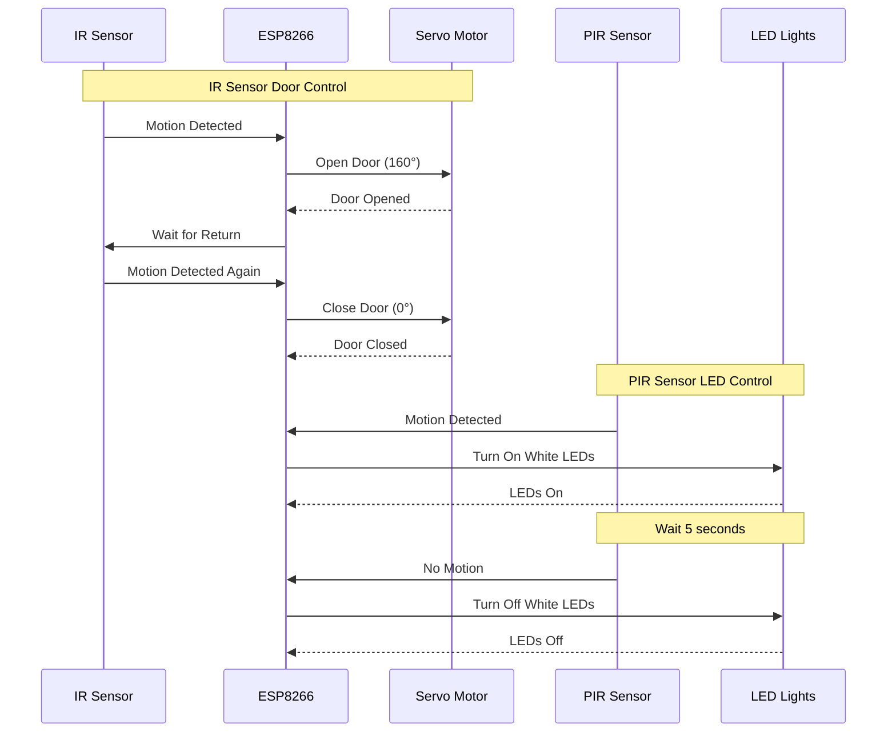
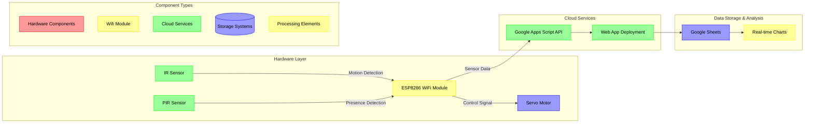

# Home Automation System

A smart home automation system developed using **Arduino** and **Flutter**, designed to enhance lighting control and improve user convenience.

## Features
- Automatic light activation and deactivation based on room entry and exit.
- Mobile application control built with **Flutter**.
- Integration with **Arduino** for seamless hardware-software interaction.

## Technologies Used
- **Flutter**: This is for developing the mobile application interface.
- **Arduino**: For hardware implementation and communication.
- **Wi-Fi (ESP8266/ESP32)**: For wireless communication between devices.

## Getting Started

### Prerequisites
- **Arduino IDE** installed on your computer.
- **Flutter SDK** set up for mobile app development.
- ESP8266/ESP32 Wi-Fi module.

### Installation

1. Clone the repository:
   ```bash
   git clone https://github.com/banu4prasad/home-automation.git
   ```

2. Open the **Arduino** folder and upload the code to your board using Arduino IDE.

3. Navigate to the **Flutter** folder, install dependencies, and run the app:
   ```bash
   cd FlutterApp
   flutter pub get
   flutter run
   ```

## Usage
- Connect the hardware to Wi-Fi using the provided configuration settings.
- Use the mobile app to control lights, customize colors, and monitor system status.

## Project Structure
- **/Arduino**: The Arduino source code for hardware control.
- **/FlutterApp**: Contains the Flutter project for the mobile application.

## Working

#### Sensor working


#### Sensor Data Flow



## Future Enhancements
- Add voice control capabilities.
- Extend automation features to other appliances.
- Implement machine learning for predictive lighting control based on user behavior.

## License
This project is licensed under the MIT License - see the [LICENSE](LICENSE) file for details.

## Acknowledgments
- Inspiration from IoT smart home technologies.
- Support from the developer community.
